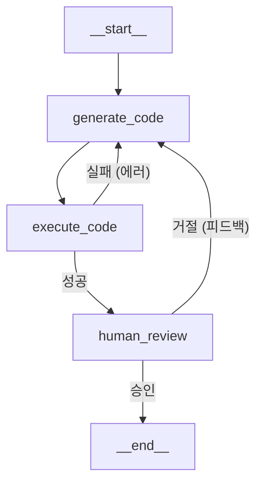

# 시스템 아키텍처 (System Architecture)

이 문서는 **자가 치유 코딩 에이전트**의 내부 구조와 동작 원리를 설명합니다.

## 1. LangGraph 워크플로우

에이전트는 **LangGraph**의 `StateGraph`를 사용하여 상태 기반으로 동작합니다.

### 그래프 구조 (Graph Flow)

### 노드 설명 (Nodes)

1. **`generate_code` (Generator)**
    * **역할**: 사용자의 요청이나 에러 로그, 피드백을 바탕으로 파이썬 코드를 생성합니다.
    * **입력**: 대화 기록 (`messages`), 이전 에러 (`error`), 사용자 피드백 (`human_feedback`)
    * **출력**: 생성된 코드 (`code`)
    * **모델**: `gemini-2.0-flash`

2. **`execute_code` (Executor)**
    * **역할**: 생성된 코드를 샌드박스(현재는 로컬 `exec`) 환경에서 실행합니다.
    * **입력**: 코드 (`code`)
    * **출력**: 실행 결과 (`execution_output`) 또는 에러 (`error`)
    * **로직**:
        * 실행 성공 시 -> `human_review`로 이동
        * 실행 실패 시 -> `generate_code`로 이동 (최대 3회 재시도)

3. **`human_review` (Reviewer)**
    * **역할**: 사람의 최종 승인을 기다리는 중단점(Checkpoint)입니다.
    * **설정**: `interrupt_before=["human_review"]`
    * **동작**:
        * 사용자가 UI에서 "승인" 버튼을 누르면 그래프가 종료됩니다.
        * 사용자가 "거절"하고 피드백을 주면, 그 내용을 가지고 `generate_code`로 돌아갑니다.

## 2. 상태 관리 (State Management)

에이전트의 상태는 `AgentState` (TypedDict)로 관리됩니다.

| 필드명 | 타입 | 설명 |
| :--- | :--- | :--- |
| `messages` | `list[BaseMessage]` | 사용자와 AI 간의 대화 기록 |
| `code` | `str` | 현재 생성된 파이썬 코드 |
| `iterations` | `int` | 자가 수정 반복 횟수 (무한 루프 방지) |
| `error` | `str` | 코드 실행 중 발생한 에러 메시지 |
| `execution_output` | `str` | 코드 실행 결과 (표준 출력) |
| `human_feedback` | `str` | 사용자의 검토 피드백 (승인/거절 사유) |

## 3. 디렉토리 구조

프로젝트는 기능 단위로 응집도를 높이는 **Vibe Coding** 스타일을 따릅니다.

* `src/features/coding_agent/`: 에이전트의 모든 로직이 이 폴더 하나에 모여 있습니다.
  * `schema.py`: 데이터 구조 정의
  * `nodes.py`: 실제 비즈니스 로직 (함수)
  * `graph.py`: 노드들을 연결하는 그래프 정의
* `src/ui/`: 사용자 인터페이스 관련 코드
